import { default as base, syntaxHighlighter, aspect43 } from '@mdx-deck/themes'

export const themes = [base, syntaxHighlighter, aspect43]

# Landing Page in 5 Minutes

Create a Static Site using GatsbyJS and ZEIT Now

SurabayaJS - Friday, June 20th 2019

---

# 🤔 Who am I?

- My name is **Griko Nibras**
- Born and raised in Surabaya since 1996
- College student at **Institut Teknologi Adhi Tama Surabaya**
- Love working on Laravel, Node.js, React, and Vue
- Focused on both frontend and backend, but mostly backend
- Currently not working anywhere
- More information available at <https://griko.id>

---

# ✨ What are we discussing?

- Scaffold project using GatsbyJS starter template
- Create a basic landing page
- Deploy on ZEIT Now

---

# 📝 Why create a landing page?

- Personal corner on the web
- Showcase your creations and projects
- Self-hosted blogging
- ...and many more

---

# 🎩 What is GatsbyJS?

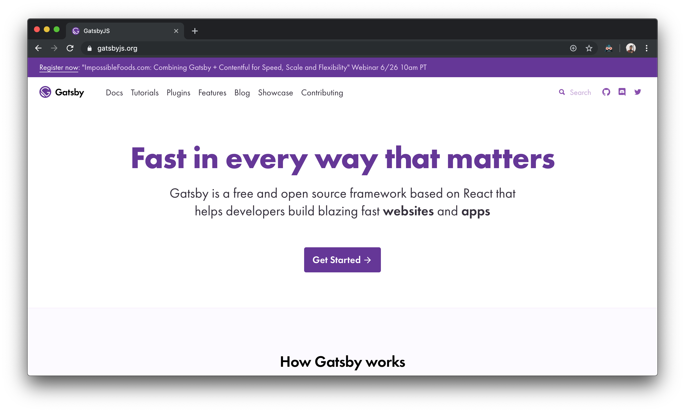

---

# 👏🏻 Why use GatsbyJS?

- Based on React
- Various plugins (image processing, Remark, etc.)
- Static progressive web app generator
- Using the latest technologies, a.k.a. JAMstack
- Hot reloading development

---

# 👀 Who uses GatsbyJS?

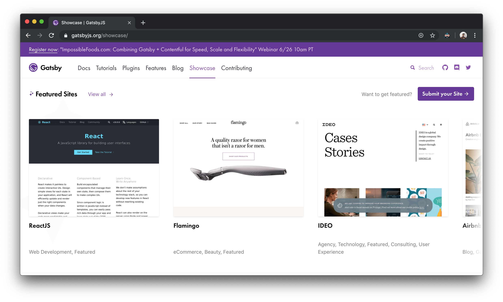

---

# ▲ What is ZEIT Now?

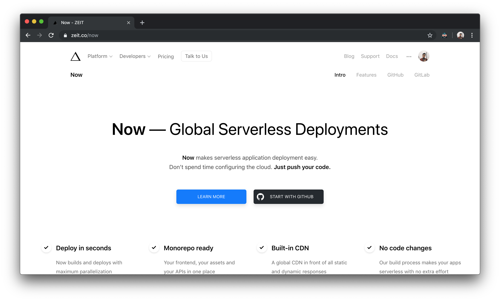

---

# 😱 Why use Now?

- Deploy in seconds (just run `now`)
- Monorepo ready (multiple projects in one deployment)
- Built-in CDN (no need for external CDN configs)
- Free\*

_\*not exactly free_

---

# 🏊🏻‍♂️ Deployment Example using Now


---

# 😎 Preparation

- Node.js and Yarn (optional)
- Knowledge of React (because GatsbyJS)
- Terminal emulator
- Your favorite editor (Visual Studio Code, Vim, etc.)
- Stable internet connection
- ZEIT account and GitHub account
- Plenty of coffee and patience

---

# 🥳 Install GatsbyJS CLI

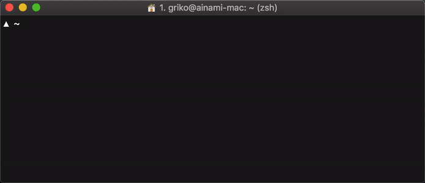

`yarn global add gatsby-cli`

---

# 🔥 Pick a starter

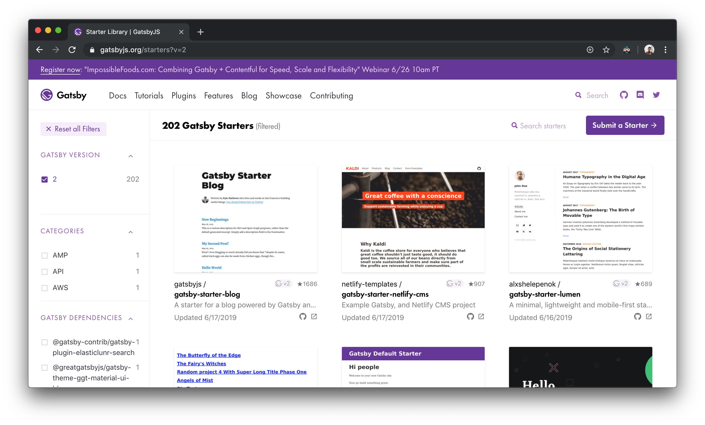

List of starters available at <https://gatsbyjs.org/starters>

---

# 🎉 Using Portfolio Cara

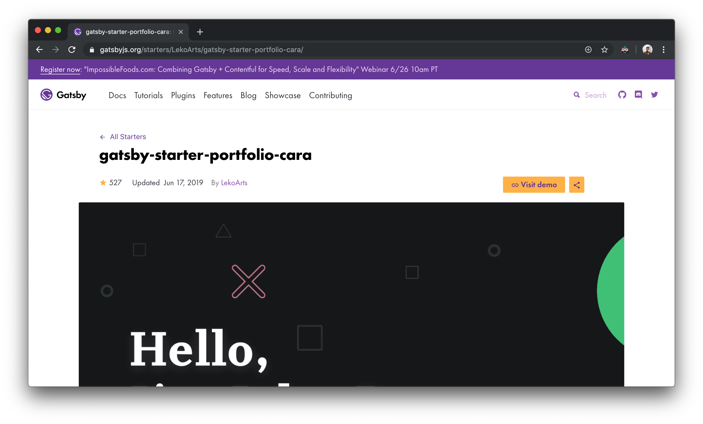

https://github.com/LekoArts/gatsby-starter-portfolio-cara

---

# 🎉 Using Portfolio Cara

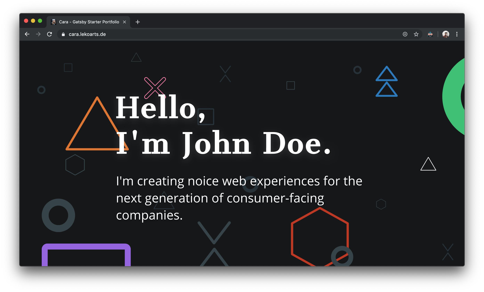

https://github.com/LekoArts/gatsby-starter-portfolio-cara

---

# 🏃🏻‍♂️ Scaffold starter project


`gatsby new <directory name> <github starter link>`

---

# 🙇🏻‍♂️ Test development server

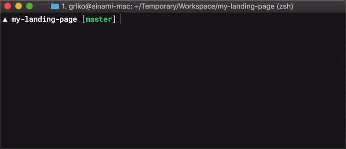

Run `yarn develop` and access `localhost:8000`

---

# 🙇🏻‍♂️ Test development server

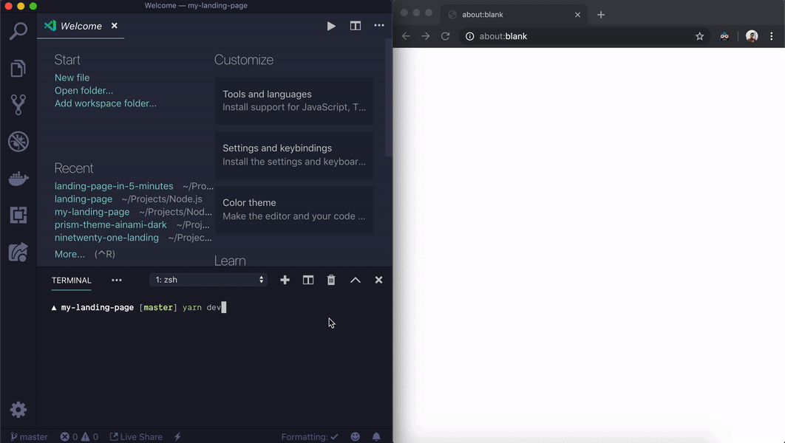

`yarn develop` using the `-o` flag opens the browser automatically

---

# 🔥 Hot reloading development

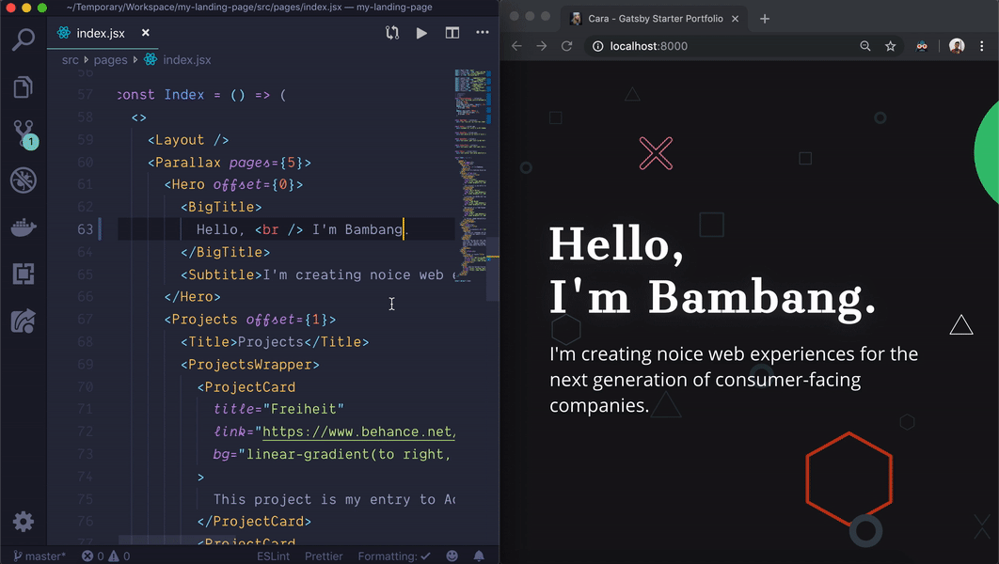

Edit, save, partial reloading, repeat 👏🏻

---

# △ Install Now CLI


`yarn global add now`

---

# 🔑 Login to Now

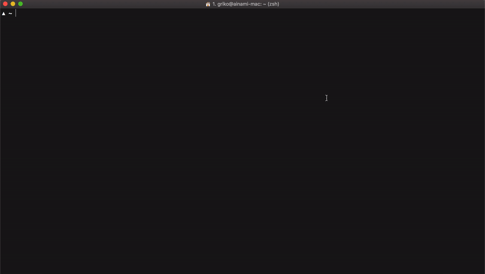

`now login`, open sent email, and click the magic link to login

---

# 😪 Create now.json

```json
{
  "name": "landing-page-in-5-minutes",
  "version": 2,
  "alias": ["landing-page-in-5-minutes"],
  "builds": [
    {
      "src": "package.json",
      "use": "@now/static-build",
      "config": { "distDir": "public" }
    }
  ],
  "public": true,
  "regions": ["all"]
}
```

---

# ✏️ Modify package.json

```json
{
  "scripts": {
    ...
    "now-build": "yarn build"
  }
}
```

Deployment will fail if there is no `now-build` to execute

---

# # now


---

# # now


---

# 🎉 Live result

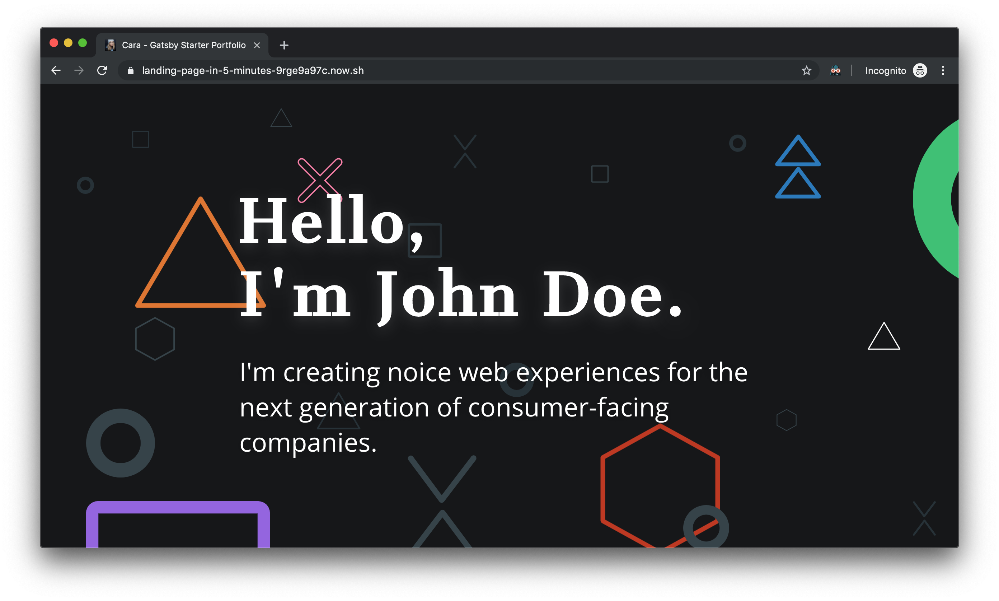

Available at https://landing-page-in-5-minutes-9rge9a97c.now.sh

---

# 🙅🏻‍♂️ Set alias


`now alias` will alias defined on `now.json` file

`now alias <subdomain>` will alias given subdomain

---

# 💁🏻‍♂️ Other examples

- Push to GitHub, Now re-deploys automatically
- If build fails, current deployment will not be aliased
- Staging aliases are available
- Local testing using `now dev`

---

# 🙅🏻‍♂️ Ask me anything

Do ask anything related to GatsbyJS or ZEIT Now

---

# 👋🏻 Thank you and goodbye!

This slide is available on:

https://landing-page-in-5-minutes-deck.now.sh

https://griko.dev/landing-page-in-5-minutes-slides (`.pptx`)
